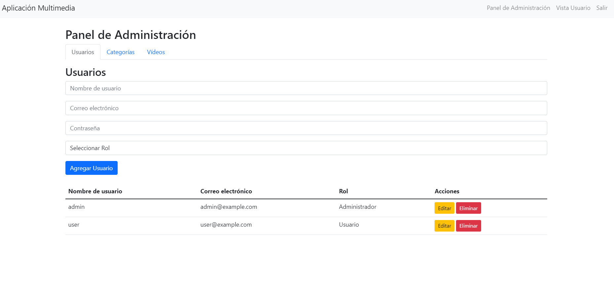
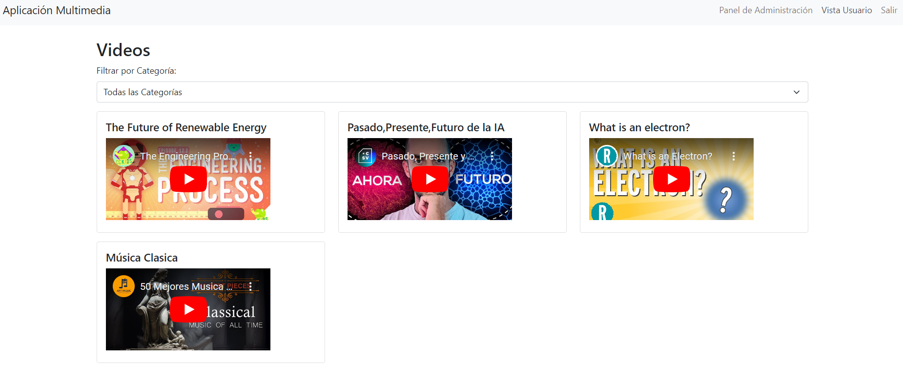

# Práctica Final - Youssef Chelh

Plataforma de gestión de contenido multimedia desarrollada con Angular en el frontend y Node.js en el backend.

## Capturas de Pantalla

### Panel de Administración


### Vista de Videos


## Instrucciones de Instalación y Ejecución

1. **Clonar el repositorio:**
   ```
   git clone https://github.com/Yc3t/app-angular
   ```

2. **Backend:**
   - Navegar a la carpeta backend:
     ```
     cd backend
     ```
   - Instalar dependencias:
     ```
     npm install
     ```
   - Iniciar el servidor:
     ```
     node server.js
     ```

3. **Frontend:**
   - Abrir `index.html` en un navegador web.
   - Alternativamente, usar un servidor local (por ejemplo, la extensión "Live Server" de Visual Studio Code).

## Usuarios Predefinidos

Para probar la funcionalidad de la aplicación, se han creado dos usuarios en la base de datos:

1. **Administrador:**
   - Usuario: `admin`
   - Contraseña: `adminpassword`

2. **Cliente:**
   - Usuario: `client`
   - Contraseña: `clientpassword`

## Características

- Panel de administración para gestionar usuarios, categorías y videos.
- Interfaz de usuario para visualizar videos categorizados.
- Sistema de autenticación con roles de usuario.

## Tecnologías Utilizadas

- Frontend: Angular, Bootstrap
- Backend: Node.js, Express
- Base de Datos: SQLite

## Contribuir

Si deseas contribuir a este proyecto, por favor crea un fork del repositorio y envía tus pull requests para revisión.

## Licencia

Este proyecto está bajo la licencia [MIT](https://opensource.org/licenses/MIT).